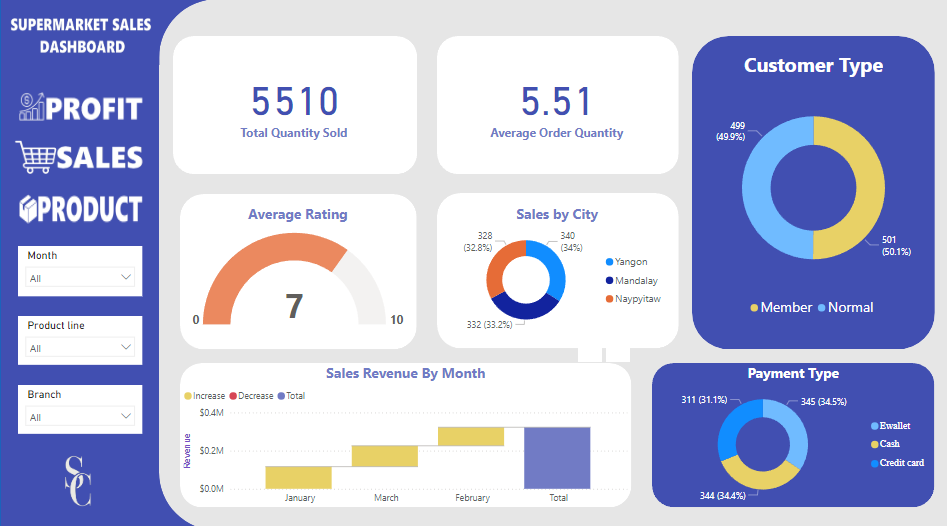

# Supermarket Sales Dashboard
Welcome to the Supermarket Sales Dashboard project! This Power BI dashboard provides a comprehensive analysis of supermarket sales data, offering valuable insights into sales performance, trends, and customer behavior.

# Introduction
In today's competitive retail landscape, understanding and leveraging sales data is essential for supermarkets to make informed decisions and stay ahead of the curve. The Supermarket Sales Dashboard is a powerful tool designed to empower supermarket managers, analysts, and stakeholders with actionable insights derived from sales data.

# Key Features
- Triple Layered Dashboard: The dashboard is structured in three layers, allowing users to drill down from high-level summaries to granular details effortlessly.
- Custom Navigation Buttons: Intuitive navigation buttons are strategically placed throughout the dashboard, enabling seamless exploration and interaction.
- Comprehensive Sales Analysis: Gain a deep understanding of sales performance across various dimensions, including product categories, regions, time periods, and customer segments.
- Visualizations and Insights: Utilizing advanced visualizations, the dashboard presents key metrics, trends, and patterns in a clear and engaging manner, facilitating data-driven decision-making.
- Dynamic Filtering and Interactivity: Users can dynamically filter and interact with the data, enabling personalized analysis tailored to specific needs and interests.

# Dash Board Overview

## Sales Dashboard

