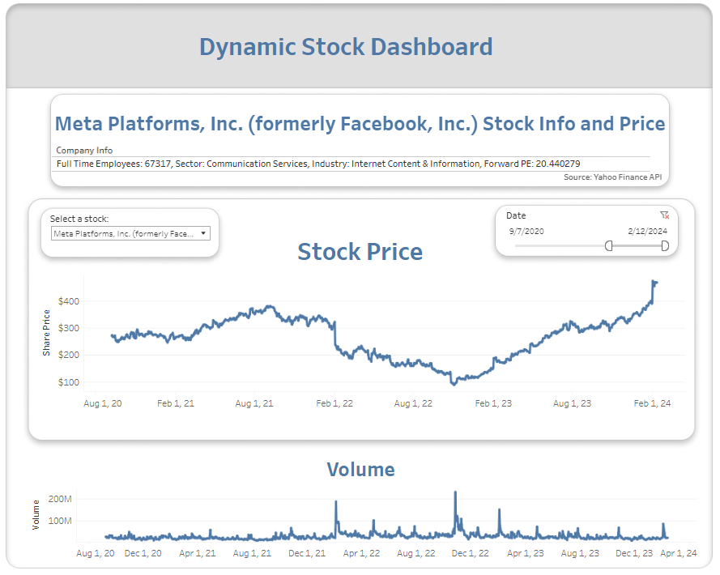

# Yahoo Finance API Stock Dashboard

Welcome to the Yahoo Finance API Stock Dashboard! This dynamic dashboard harnesses the power of the Yahoo Finance API (yfinance) to provide insightful visualizations of stock market data.

With intuitive filters allowing selection of specific stocks and dates, this dashboard empowers users to explore stock price trends over time and examine trading volume for their chosen stocks. Alongside this, users can access valuable information about each selected stock, including details such as the number of full-time employees, sector, industry, and forward price-to-earnings ratio (PE).

# Overview

You can also explore the interactive dashboard [here](https://stavroschatzipavlidis.github.io/Portfolio/Dashboard.html), embedded seamlessly using the Tableau JavaScript API.